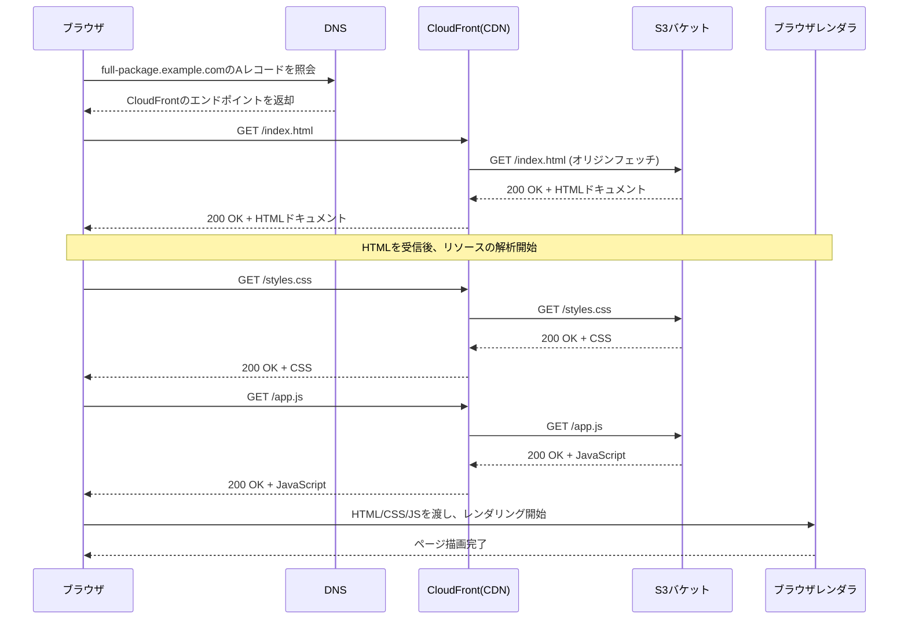
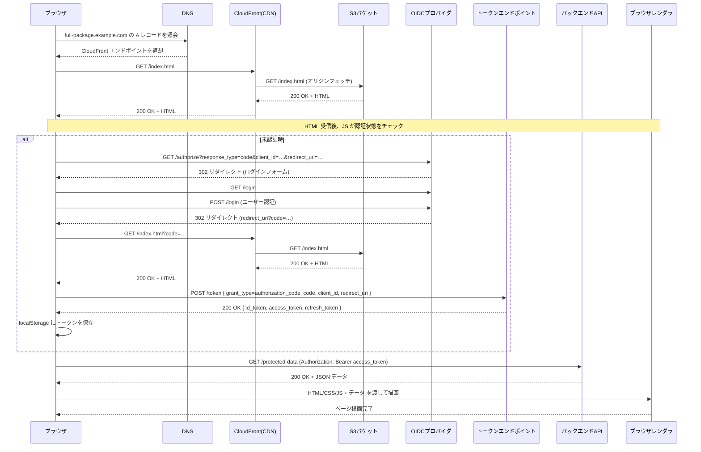
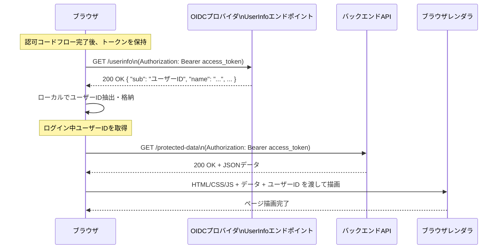

## 構成案(フルパッケージのURLからのブラウザ表示までのシーケンス図)

```mermaid
sequenceDiagram
    participant ブラウザ
    participant DNS
    participant CDN as CloudFront(CDN)
    participant S3 as S3バケット
    participant レンダラ as ブラウザレンダラ

    ブラウザ->>DNS: full-package.example.comのAレコードを照会
    DNS-->>ブラウザ: CloudFrontのエンドポイントを返却
    ブラウザ->>CDN: GET /index.html
    CDN->>S3: GET /index.html (オリジンフェッチ)
    S3-->>CDN: 200 OK + HTMLドキュメント
    CDN-->>ブラウザ: 200 OK + HTMLドキュメント

    Note over ブラウザ,レンダラ: HTMLを受信後、リソースの解析開始

    ブラウザ->>CDN: GET /styles.css
    CDN->>S3: GET /styles.css
    S3-->>CDN: 200 OK + CSS
    CDN-->>ブラウザ: 200 OK + CSS

    ブラウザ->>CDN: GET /app.js
    CDN->>S3: GET /app.js
    S3-->>CDN: 200 OK + JavaScript
    CDN-->>ブラウザ: 200 OK + JavaScript

    ブラウザ->>レンダラ: HTML/CSS/JSを渡し、レンダリング開始
    レンダラ-->>ブラウザ: ページ描画完了
```

## フルパッケージ + OIDC準拠のOAuthを組み込んだ場合のシーケン図

```mermaid
sequenceDiagram
    participant ブラウザ
    participant DNS
    participant CDN as CloudFront(CDN)
    participant S3 as S3バケット
    participant OIDC as OIDCプロバイダ
    participant TokenEP as トークンエンドポイント
    participant API as バックエンドAPI
    participant レンダラ as ブラウザレンダラ

    %% 静的資産の取得
    ブラウザ->>DNS: full-package.example.com の A レコードを照会
    DNS-->>ブラウザ: CloudFront エンドポイントを返却
    ブラウザ->>CDN: GET /index.html
    CDN->>S3: GET /index.html (オリジンフェッチ)
    S3-->>CDN: 200 OK + HTML
    CDN-->>ブラウザ: 200 OK + HTML

    Note over ブラウザ,レンダラ: HTML 受信後、JS が認証状態をチェック

    alt 未認証時
        %% 認可コードフロー開始
        ブラウザ->>OIDC: GET /authorize?response_type=code&client_id=…&redirect_uri=…
        OIDC-->>ブラウザ: 302 リダイレクト (ログインフォーム)
        ブラウザ->>OIDC: GET /login
        ブラウザ->>OIDC: POST /login (ユーザー認証)
        OIDC-->>ブラウザ: 302 リダイレクト (redirect_uri?code=…)
        ブラウザ->>CDN: GET /index.html?code=…
        CDN->>S3: GET /index.html
        S3-->>CDN: 200 OK + HTML
        CDN-->>ブラウザ: 200 OK + HTML

        %% トークン取得
        ブラウザ->>TokenEP: POST /token { grant_type=authorization_code, code, client_id, redirect_uri }
        TokenEP-->>ブラウザ: 200 OK { id_token, access_token, refresh_token }
        ブラウザ->>ブラウザ: localStorage にトークンを保存
    end

    %% 保護されたリソースの取得
    ブラウザ->>API: GET /protected-data (Authorization: Bearer access_token)
    API-->>ブラウザ: 200 OK + JSON データ

    %% 最終レンダリング
    ブラウザ->>レンダラ: HTML/CSS/JS + データ を渡して描画
    レンダラ-->>ブラウザ: ページ描画完了
```

## フルパッケージ + ログインしてるユーザーID取得のシーケンス図

```mermaid
sequenceDiagram
    participant ブラウザ
    participant UserInfoEP as OIDCプロバイダ\nUserInfoエンドポイント
    participant API as バックエンドAPI
    participant レンダラ as ブラウザレンダラ

    Note over ブラウザ: 認可コードフロー完了後、トークンを保持

    ブラウザ->>UserInfoEP: GET /userinfo\n(Authorization: Bearer access_token)
    UserInfoEP-->>ブラウザ: 200 OK { "sub": "ユーザーID", "name": "...", ... }
    ブラウザ->>ブラウザ: ローカルでユーザーID抽出・格納

    Note over ブラウザ: ログイン中ユーザーIDを取得

    ブラウザ->>API: GET /protected-data\n(Authorization: Bearer access_token)
    API-->>ブラウザ: 200 OK + JSONデータ

    ブラウザ->>レンダラ: HTML/CSS/JS + データ + ユーザーID を渡して描画
    レンダラ-->>ブラウザ: ページ描画完了
```
