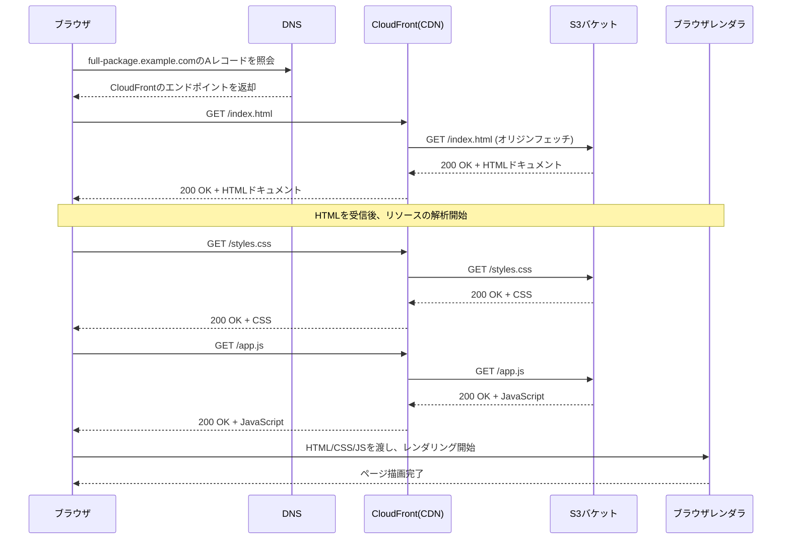
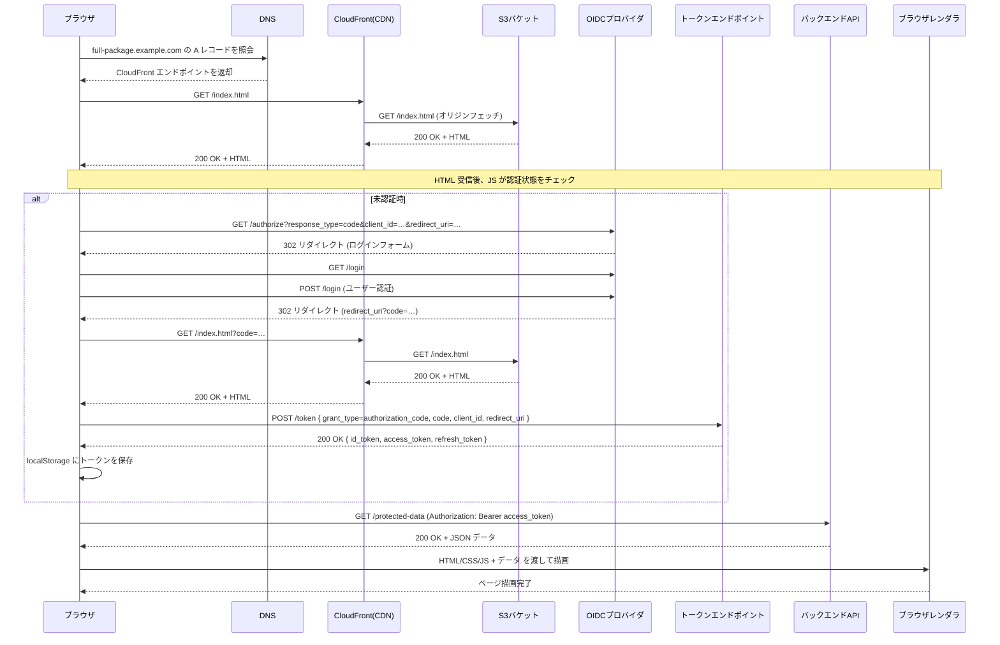
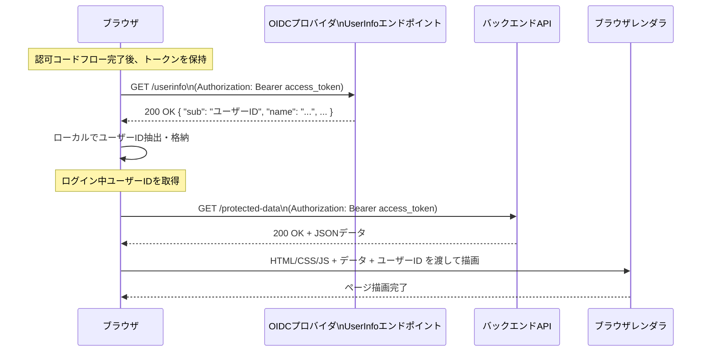

# rfc-chronicle


## 概要：
`rfc-chronicle` は、[RFCエディター](https://www.rfc-editor.org/) に公開されているRFC（Request for Comments）情報をローカルに取り込み、検索・閲覧・エクスポートできるCLIツールです。

- RFCのメタデータ取得
- 埋め込み検索（FAISSベース）による全文検索
- レコードのピン留め・管理
- JSON / CSV / Markdown形式でのエクスポート

## 技術スタック：


## インストール

```bash
# リポジトリをクローン
git clone https://github.com/tamai-hideyuki/rfc-chronicle.git
cd rfc-chronicle

# Poetryで依存関係をインストール
poetry install
````
---

## 使い方:


### RFCメタデータの取得

```bash
poetry run rfc show 1-9000
```

### 埋め込み検索

```bash
poetry run rfc search "検索キーワード"
```

### 詳細表示

```bash
poetry run rfc show <RFC番号> [--output json|csv|md]
```

### ピン留め管理

```bash
poetry run rfc pin add <RFC番号>
poetry run rfc pin list
poetry run rfc pin remove <RFC番号>
```

### エクスポート

```bash
poetry run rfc export --output md > rfc_list.md
```
---

## コントリビュート：

1. Issueを立てる
2. ブランチを作成 (`feat/`, `fix/` など)
3. PRを送付し、CIが通ったらマージを依頼

---

## 構成案(フルパッケージのURLからのブラウザ表示までのシーケンス図)



## フルパッケージ + OIDC準拠のOAuthを組み込んだ場合のシーケン図



## フルパッケージ + ログインしてるユーザーID取得のシーケンス図


