## M8: HTTPベース Web UI

以下の構成・機能が実装・動作します。

### ✔︎ シンプル HTTP Web UI 骨格構築
- `web-ui/` ディレクトリに静的ファイルを配置
    - `index.html`（CLI API 呼び出し用の `fetch` 実装）
    - `manifest.json` とアイコン 192×192, 512×512

### ✔︎ CLI バックエンド API 連携
- `<script>` 内で `fetch('/api/metadata')` 等を実行
- 取得データを `
` へ整形表示

### ✔︎ 環境準備不要・即起動
- HTTPS／CA 証明書不要、`http-server` などのシンプルな HTTP サーバで動作
- Chrome DevTools（Network / Console）でエラー無し

---
 
既存 CLI 機能を迅速にブラウザ上で可視化できる基盤が整いました。  

```mermaid
flowchart TB
  subgraph Root [プロジェクトルート]
    A[data/] --> A1[docmap.json]
    A --> A2[faiss_flat.bin]
    A --> A3[faiss_index.bin]
    A --> A4[fulltext.db]
    A --> A5[metadata.json]
    A --> A6[pins.json]
    A --> A7[texts/]
    A --> A8[vectors.npy]
    B[docker/] --> B1[docker-compose.yml]
    B --> B2[Dockerfile.backend]
    B --> B3[Dockerfile.frontend]
    B --> B4[nginx.conf]
    C[docs/] --> C1[fetch/]
    C --> C2[function.md]
    C --> C3[help.md]
    C --> C4[interactive-shell.md]
    C --> C5[milestone00.md]
    C --> C6[milestone01-tests.md]
    C --> C7[milestone02.md]
    C --> C8[milestone03.md]
    C --> C9[milestone04.md]
    C --> C10[milestone06.md]
    C --> C11[milestone07.md]
    C --> C12[milestone08.md]
    C --> C13[oauth-example.md]
    C --> C14[README.md]
    C --> C15[README02.md]
    D[.] --> A
    D --> B
    D --> C
    D --> D1[poetry.lock]
    D --> D2[pyproject.toml]
    D --> D3[README.md]
    D --> E[scripts/] --> E1[__init__.py]
    E --> E2[analyze_embeddings.py]
    E --> E3[build_embeddings.py]
    E --> E4[download_all.sh]
    E --> E5[semsearch.py]
    F[src/] --> F1[api/] --> F1a[main.py]
    F --> F2[data/]
    F --> F3[rfc_chronicle/] --> F3a[fetch_rfc.py]
    F3 --> F3b[search.py]
    F3 --> F3c[pin.py]
    D --> F
    G[tests/] --> G1[test_build_faiss_index.py]
    G --> G2[test_cli_fetch.py]
    G --> G3[test_cli_show.py]
    G --> G4[test_cli.py]
    G --> G5[test_fetch_rfc_details.py]
    G --> G6[test_fetch_rfc.py]
    G --> G7[test_index_fulltext.py]
    G --> G8[test_pins.py]
    G --> G9[test_search.py]
    G --> G10[test_utils.py]
    D --> G
    H[web-ui/] --> H1[data/]
    H --> H2[icons/] --> H2a[icon-192.png]
    H2 --> H2b[icon-512.png]
    H --> H3[index.html]
    H --> H4[manifest.json]
    D --> H
  end
```

